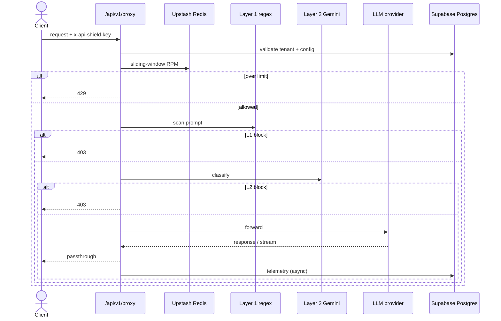

# API Sentinel

Multi-tenant LLM proxy that rate-limits tenants, runs dual-layer prompt guardrails, forwards clean traffic to upstream providers, and records telemetry in Supabase.

## Problem

Direct LLM access from many clients creates prompt-injection exposure, accidental secret leakage, and unbounded spend. Teams need a gateway that authenticates tenants, enforces RPM budgets, blocks obvious jailbreaks, and logs what happened — without rewriting every client SDK.

## Features

- Tenant API keys (`x-api-shield-key`) validated against hashed keys in Postgres
- Sliding-window rate limits per tenant via Upstash Redis
- Layer 1 heuristic regex scanner (jailbreak phrases, credential patterns, private keys)
- Layer 2 structured safety classification (Gemini Flash JSON verdict; fail-open if no key configured)
- Proxy route that forwards allowed payloads to the configured upstream
- Async telemetry logging (tokens/cost fields in schema) to Supabase
- Dashboard + playground UI (Next.js)
- Jest tests for guardrails and proxy behaviour
- GitHub Actions CI workflow

## Architecture



## Tech stack

| Layer | Choice |
|---|---|
| App | Next.js 14, React 18, TypeScript |
| Validation | Zod |
| DB | Supabase Postgres + RLS-oriented schema |
| Rate limit | Upstash Redis REST + `@upstash/ratelimit` |
| Guard L2 | Gemini API (optional OpenAI fallback key name in env) |
| Charts | Recharts (dashboard) |
| Tests | Jest |
| Deploy | Vercel (`vercel.json`) |

## Key engineering decisions

1. **Two-layer defence in depth.** Cheap regex catches known jailbreak/secret patterns in milliseconds; the micro-LLM classifier handles phrasing the regex will miss.
2. **Fail-open on missing L2 keys in development.** If `GEMINI_API_KEY` is unset, Layer 2 logs a warning and passes — document this before production; prefer fail-closed there.
3. **Tenant RPM in Redis.** Sliding window is shared across serverless instances; in-memory maps would not be.
4. **Hashed API keys in `tenants`.** Keys are not stored plaintext in the migration schema (`api_key_hash`).
5. **Honest threat claims.** This is a practical control plane, not a certified WAF. Do not quote unverified “99% injection blocked” or “25% cost saved” figures without a measured eval set.

## Getting started

### Prerequisites

- Node.js 18+
- Supabase project
- Upstash Redis database
- Optional: `GEMINI_API_KEY` for Layer 2

### Setup

```bash
git clone https://github.com/darkNIGHT669/API_Shields.git
cd API_Shields
cp .env.example .env.local
npm install
```

Environment variable names:

```
NEXT_PUBLIC_SUPABASE_URL=
SUPABASE_SERVICE_ROLE_KEY=
UPSTASH_REDIS_REST_URL=
UPSTASH_REDIS_REST_TOKEN=
GEMINI_API_KEY=
OPENAI_API_KEY=
```

Apply `supabase/migrations/00001_init.sql` in the Supabase SQL editor (tenants, members, telemetry, indexes/RLS).

```bash
npm run dev
```

Open [http://localhost:3000](http://localhost:3000). Proxy base path: `/api/v1/proxy`.

### Tests

```bash
npm test
npm run test:coverage
```

## Project structure

```
API_Shields/
├── src/app/                 # UI + API routes
│   └── api/v1/proxy/        # gateway
├── src/lib/
│   ├── guardrails.ts        # L1 + L2
│   ├── redis.ts
│   ├── security.ts
│   └── supabase.ts
├── src/tests/
├── supabase/migrations/
├── scripts/
└── .github/workflows/ci-cd.yml
```

## Deployment notes

Designed for Vercel. Configure the env vars above in the project settings and ensure the Supabase migration has been applied. Health check: `/api/health`.
